# 🎵 VIBE CODING METHODOLOGY

<div align="center">

**A systematic approach to creative coding with structured cleanup**

[](https://github.com/indraqubit/VibeCleanShip)

*Code boldly, clean systematically, ship confidently.*

---

</div>

## 🏷️ Tags

- `coding-methodology`
- `development-workflow`
- `ai-assisted-coding`
- `coding-practices`
- `software-development`
- `programming-philosophy`
- `developer-tools`
- `code-quality`
- `refactoring`
- `flow-state`
- `rapid-prototyping`
- `technical-debt`
- `clean-code`
- `agile-development`
- `pair-programming`
- `cursor-ai`
- `productivity`
- `best-practices`
- `code-organization`
- `maintainability`

---

## 🎯 What is Vibe Coding?

**Vibe Coding = Flow state programming + Systematic cleanup**

A balanced development approach that prioritizes:
- ✅ **Creative exploration** - Get ideas working fast with AI assistance
- ✅ **Systematic cleanup** - Transform creative chaos into maintainable code
- ✅ **Sustainable velocity** - Balance innovation with engineering discipline

### The Core Cycle

```mermaid
graph TD
    A[Vibe Phase 🎵] --> B[Reality Check ⚠️]
    B --> C[Structure Pass 🏗️]
    C --> D[Compliance Pass ✅]
    D --> E[Documentation 📝]
    E --> A
```


## 📚 Documentation

### 📖 Core Philosophy
- **[Vibe Coding Philosophy](./vibe-coding-philosophy.md)** - Complete methodology guide
- **[Vibe Coding Template](./vibe-coding-template.md)** - Implementation template
- **[Vibe Coding Guide by Tech Stack](./Vibe%20Coding%20Guide%20by%20Tech%20Stack.md)** - Stack-specific workflows

### 🤝 Collaboration & Partnership
- **[Sparring Partner Concept](./SPARRING_PARTNER.md)** - Four pillars for effective collaboration in vibe coding
- **[Sparring Partner Deep Dive](./SPARRING_PARTNER_DEEP_DIVE.md)** - Detailed exploration of partnership dynamics

### 🛠️ Tools & Frameworks
- **[vibe-coding-framework.js](./vibe-coding-framework.js)** - JavaScript utility for session management

---

## 🚀 Quick Start

### 1. Choose Your Stack
```bash
# Web Development
cursor + react + typescript

# Backend/API
clave + nodejs + typescript

# Audio/DSP
juce + cpp + cmake
```

### 2. Vibe Mode On 🧘
```javascript
// Start vibing
const session = new VibeSession('react');
session.start();
// AI assists, you create: ✅ working prototypes, ❌ perfect code
```

### 3. Reality Check 🔍
```bash
# Check your vibe
clang++ -fsanitize=address main.cpp  # Memory safety
./build/app                          # Functional test
```

### 4. Cleanup & Ship 🚀
```javascript
	session.activity('Component created', false);
session.activity('Props drilling everywhere', true);

setTimeout(() => {
  session.initiateCleanup();
}, 30 * 60 * 1000); // 30 min reminder
```

---

## 🏭 Supported Tech Stacks

| Stack | Vibe Boosters | Danger Zones | Cleanup Tools |
|-------|--------------|-------------|---------------|
| **React + TS** | Hot reload, AI patterns | Type `any`, nested components | Cursor Composer |
| **Node.js + Express** | Fast endpoints, SQL | SQL injection, sync ops | Zod + error middleware |
| **C++ + JUCE** | Algorithm translation, examples | Memory leaks, raw pointers | valgrind + RAII |
| **FastAPI + SQLAlchemy** | Type hints, auto-docs | N+1 queries, sync calls | async/await + eager loading |
| **Rust + Tokio** | Compiler safety, Cargo | `.unwrap()`, clones | `anyhow` + error handling |

---

## 📈 Feasibility Examples

### Web App Feature (25 min → Production)
```typescript
// Vibe: Working cart feature
function ShoppingCart() {
  const [items, setItems] = useState<any[]>([]);
  // AI helps: generate component fast
  return <div>{items.map(item => <CartItem item={item} />)}</div>;
}

// Reality Check: Renders without crash ✅

// Structure: 2 hours later
interface CartItem { id: string; name: string; price: number; }
function ShoppingCart() {
  const [items, setItems] = useState<CartItem[]>([]);
  // Extract to custom hooks, add error handling
}
```

### Audio Plugin Algorithm (1 hour → Released)
```cpp
// Vibe: Working reverb
void processBlock(AudioBuffer<float>& buffer) {
    float* delay = new float[44100]; // Leak temporarily OK
    // Get DSP working first
}

// Structure: Next day
class ReverbProcessor {
    AudioBuffer<float> delayBuffer; // RAII, no leaks
    // RT-safe, proper resource management
};
```

---

## 🎯 Philosophy in 60 Seconds

### Vibe Coding Values
- **Speed > Perfection** - Working code beats polished architecture
- **AI as Pair Programmer** - You create, AI handles repetition
- **Flow State First** - Creative momentum trumps overthinking
- **Cleanup is Planned** - Debt payment scheduled, not optional

### Sustainable Balance
```text
80% Creative Flow   +   20% Engineering Discipline   =   Velocity 🎯
```

**Without cleanup**: Innovation stalls in technical debt
**Without vibe**: Ideas die in over-engineered analysis paralysis

---

## 🏆 Success Stories

### Audio Plugin Development
*"Went from idea to working prototype in 2 hours. Next day: production-ready plugin with proper RT safety."*

### Web App Features
*"Vibe sessions cut feature development time by 60%, systematic cleanup maintained code quality."*

### API Development
*"Vibe approach: working endpoints in 30 mins each. Cleanup pass: production-grade APIs."*

---

## 🛠️ Development Setup

### Prerequisites
- Node.js 18+ (for framework utilities)
- Your preferred AI coding assistant
- Git for commit discipline

### Usage
```bash
# Clone this methodology
git clone https://github.com/indraqubit/VibeCleanShip.git

# Use the framework
node vibe-coding-framework.js

# Read the docs
open vibe-coding-philosophy.md
```

---

## 🤝 Contributing

**This isn't just a guide—it's a living methodology.**

### Ways to Contribute
- **Experience reports**: Add your vibe coding success/failure stories
- **Stack guides**: Document workflows for new tech stacks
- **Tool integration**: Scripts and templates for new AI tools
- **Cleanup patterns**: Proven refactoring strategies

### Guidelines
1. **Test methodology first** - Ensure it works for your use case
2. **Document trade-offs** - What's faster vs what's better
3. **Share concrete examples** - Code snippets, time benchmarks
4. **Update philosophy** - As you learn, contribute back

---

## 🎵 Core Principles

### Five Universal Truths
1. **Vibe = Speed + Exploration** - Not perfection, but working solutions
2. **AI handles boilerplate** - You focus on creativity and decisions
3. **Commit early, commit often** - `vibe:` commits are safe spaces
4. **Cleanup is mandatory** - Just deferred, never exempted
5. **Know your stack's dangers** - Each technology has unique footguns

### Tool Philosophy
- **Cursor Chat**: For rapid experimental coding
- **Cursor Composer**: For multi-file architecture cleanup
- **Gemini Code Assist**: For standards compliance and optimization
- **Cline**: For reality checks and technical validation

### Timing Philosophy
```text
Immediate (5 mins): Does it compile/run/work?
Within 24 hours: Basic cleanup and improvements
Before ship: Production readiness and documentation
```

---

## 📞 Contact & Community

- **Issues**: [GitHub Issues](https://github.com/indraqubit/VibeCleanShip/issues)
- **Discussions**: Share your vibe coding experiences
- **Collaborate**: Help improve this methodology

### Recommended Reading
- [Vibe Coding Philosophy](./vibe-coding-philosophy.md) - Deep dive
- [Vibe Coding Template](./vibe-coding-template.md) - Implementation guide
- [Stack-Specific Workflows](./Vibe%20Coding%20Guide%20by%20Tech%20Stack.md) - Technical details
- [Sparring Partner Concept](./SPARRING_PARTNER.md) - Collaboration framework
- [Sparring Partner Deep Dive](./SPARRING_PARTNER_DEEP_DIVE.md) - Partnership dynamics

---

## 🎉 Final Wisdom

**The best code is code that ships.**

Vibe coding isn't reckless—it's strategic exploration with planned cleanup. Balance creative freedom with engineering discipline.

**Code boldly. Clean systematically. Ship confidently.** 🚀

---

<div align="center">

*Made with ❤️ for developers who want to create fast and maintain code long-term*

[](https://github.com/indraqubit/VibeCleanShip)

</div>
